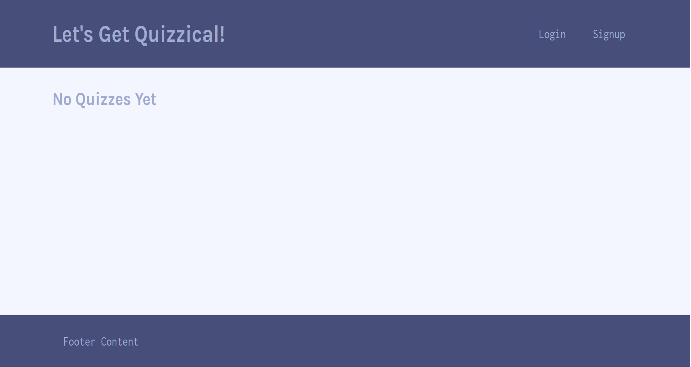

# **MERN Stack Quiz Application**
  
## **The Repository**
#### GitHub: https://github.com/loriful/quiz-quiz

## **Deployment**
#### Heroku:   https://shielded-dusk-33243.herokuapp.com/

## **Description**
Project 3. MERN stack quiz application using Apollo GraphQL and JWT authentication.

Practice: 
  - JavaScript
  - MongoDB
  - Mongoose
  - Express
  - React
  - Node
  - JSON Web Token
  - Apollo graphQL

## **Table of Contents**
- [Description](#description)
- [Installation](#installation)
- [Usage](#usage)
- [Questions](#questions)

## **The Site View**

  
  </b>
  </b>

## **Installation**
- Requires Node and MongoDB, and npm packages Express and Mongoose
- Run install from the root directory
- Deployed to Heroku for testing and use

## **Questions**
### Github Profile:  https://github.com/loriful
## Created by Alex Fields, Lori Tipton, and Shawn Willard

### You may contact tiptonica@gmail.com with any questions related to this repository.

  
  